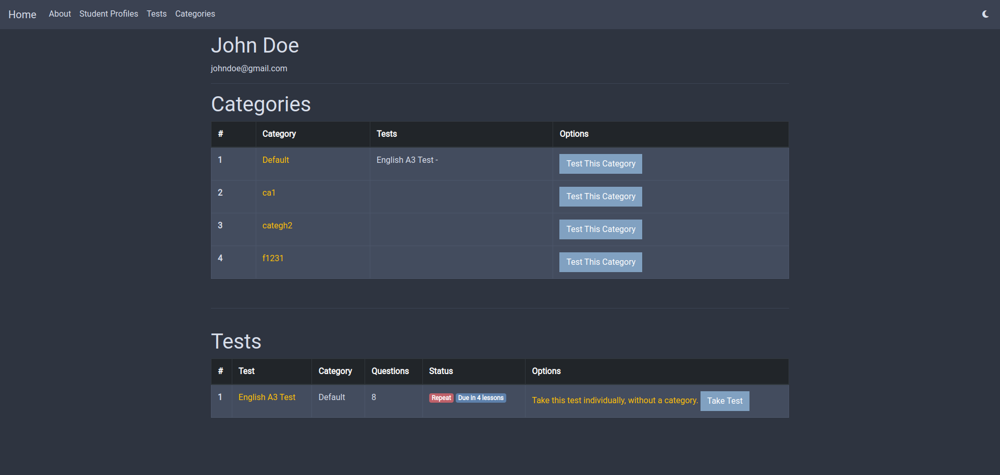
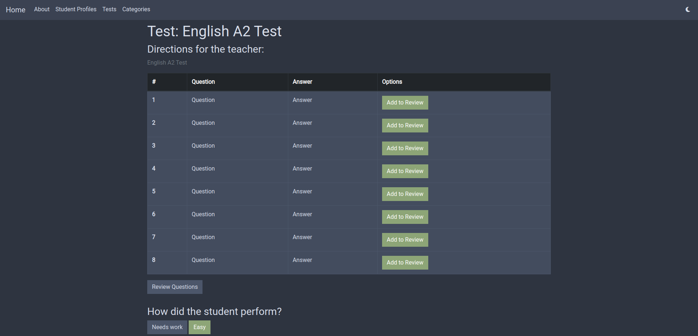

# Lessons With A Native
A web app for managing students, creating tests, and basically teaching students online. Built for one of my clients. 

Here's a list of all this app can do.
* Create student profiles.
* Manage your students.
* Create tests.
* Add questions to your tests.
* Organize your tests into categories.
* Track each student's progress on each test.
* Create Email Presets - These are email templates you can prepare for each student - and send them to a student.
* Backup all your data - Download CSV files of all your data
* You can obviously import all your data back as well
* And much, much more.

This project was actually made for my very first client, so I worked really hard and had the whole thing built super fast. 

## Home - and Backups
This is what the homepage looks like: 
It is very basic. This is also where you backup your data. So, you can export and import your data from here.

## Student Profiles
This is what Student Profiles look like: 
You should create a new Profile for each user. All you need is their name and their E-mail. This email is used to send them emails which you do from inside the app.

You can track the progress of each student on each test or on each category of tests. This is what a Profile looks like: 

## Taking Tests

This is what it looks like to take a test: 
If you grade the student good, the test status will change to Good. If you grade that he needs work, the test will repeat after six lessons. The status will change to "Needs Work" and will change to "Due" when it's due. Newly created tests will have a "New" status. In this way, you can track the progress of each student on each test and category of tests. It makes learning a lot easier.

You can also add questions to review. So, if the student is having trouble with a certain question, click "Add To Review". Review questions can be accessed from the "Review Questions" button below the grades. This is what they look like: 

## Tests and Questions
You can create, update, delete tests from the Tests page. You can also change their order, move them up or down in order. When you open a test, you can add questions to the test. You can also add it to an existing category. By default, all tests go to a category called "Default". 

___

There's a lot of features to explore in this web app, too many to list here. So allow me to stop. :)

## Installation Instructions
1. Make sure you have Python and Django installed, along with all other required libraries. You can find them all in the requirements.txt file.
```bash
pip install requirements.txt
```
2. Download the project code from GitHub and extract it on your computer.
```bash
git clone https://github.com/hassanaziz0012/lessons-with-a-native.git
```
3. Open up your terminal and CD into the project directory (where the manage.py file is).
```bash
cd lessons-with-a-native
```
4. Run "manage.py runserver" in your terminal to start the local server.
```bash
python manage.py runserver
```

Explore the site and see what it is capable of on your own. The design is based on the Nord theme, which I'm a huge fan of. But the app's functionality is the most important thing here. Anyway, enjoy and thank you for reading! :)

## Author
- Hassan Aziz
- Web Developer and Designer
- Website: https://www.hassandev.me
- Check out my other [web projects](https://www.hassandev.me/projects)
